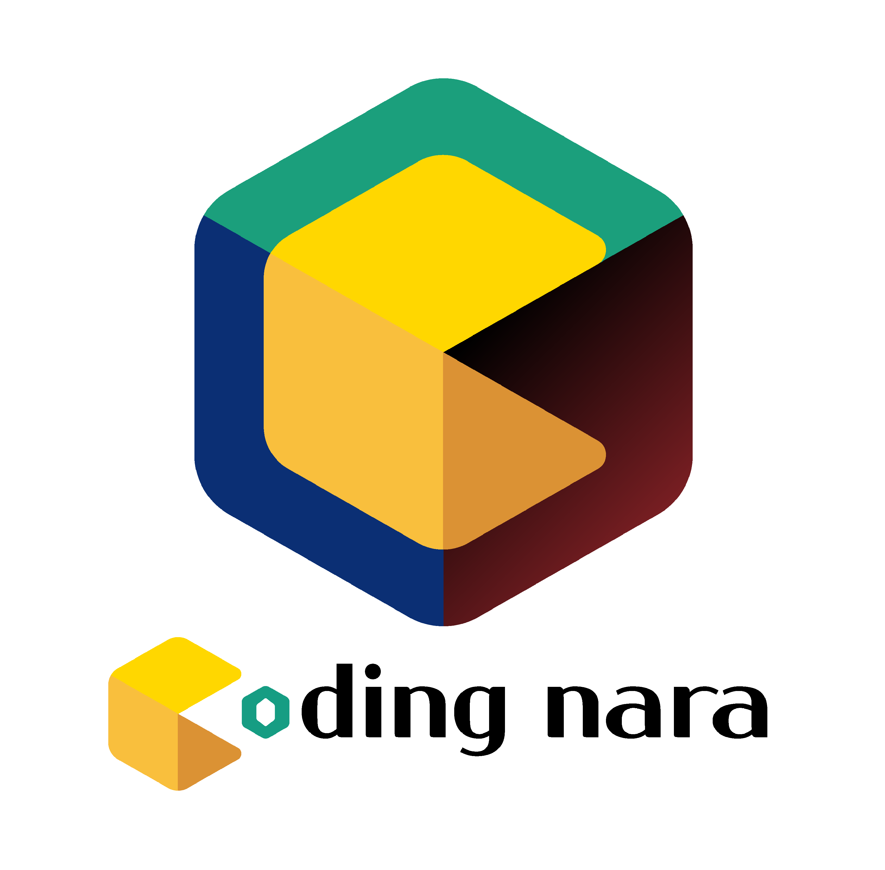
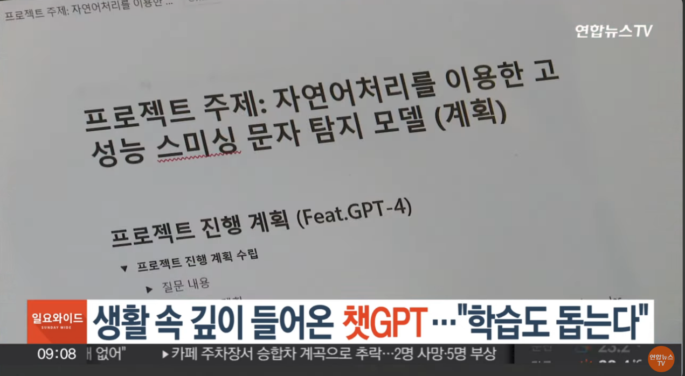

- 💻I'm a Software Engineer Interested in Python, Web and Deep Learning.
- 🌏 I am from South Korea and living in Seoul.
- 🔭 I’m currently studying at Sejong University.
- 🌱 I’m currently learning Python / C++. 
- 🚀 I always take care not to stay in my comfort zone.
- 📫 How to reach me: urinane1004@gmail.com

**Languages and Tools**  

<code></code> <code></code>  <code></code> <code></code> <code></code> <code></code> <code></code> 

그 외 활동
 
Coding-nara 공동창업(2023.01.23~) 교육서비스업 진행중 사업자등록번호 148-14-01860

 
연합뉴스tv에 프로젝트 출연

한국데이터산업진흥원 [2023]자연어처리기반 딥러닝기술 융합과정-2차 수료
 
사이버보안 AI 빅데이터 챌린지 2023 본선진출 (2023.09.23~)
 
제11회 2023 빅콘테스트 생성형 AI부문 본선진출 (2023.10.1~) 상위2팀 대상 or 최우수 과연..
